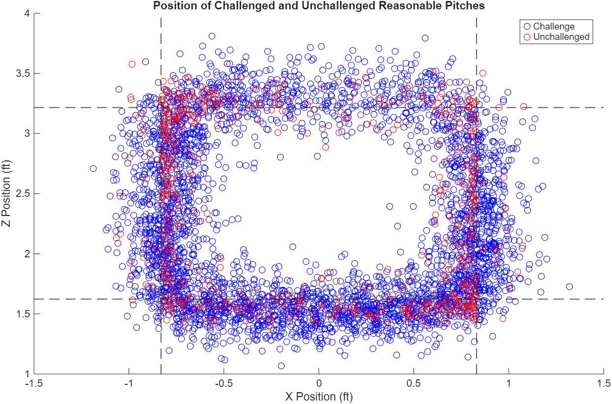
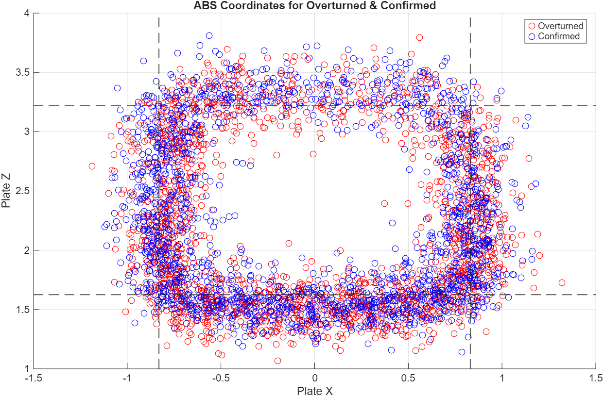
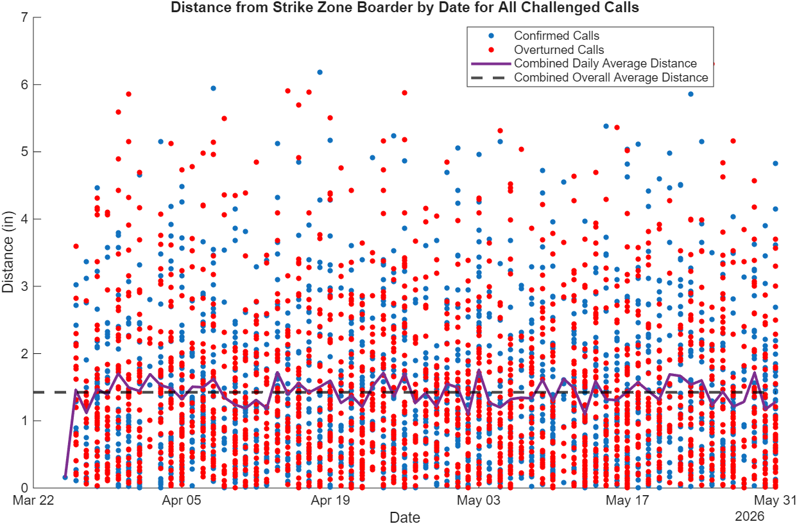
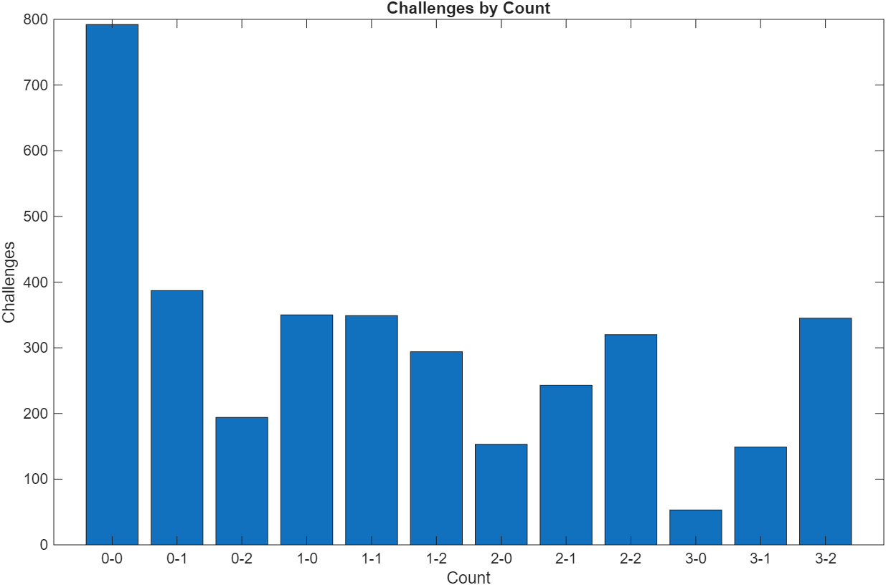
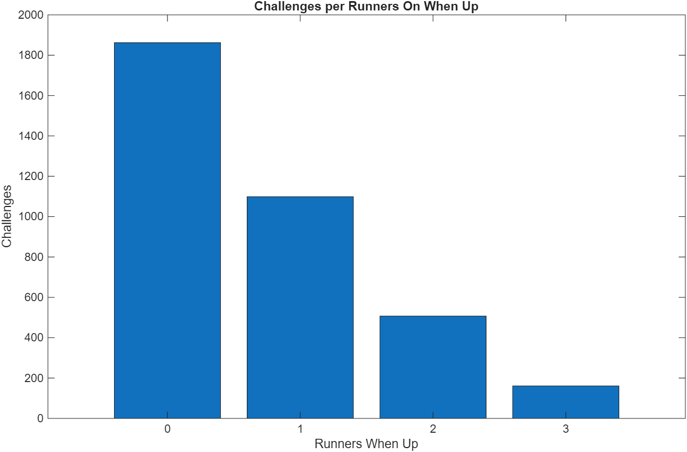

# How Context Influences ABS Challenges
## Overview
Automated Ball-Strike (ABS) was implemented at the beginning of the 2026 MLB season. It allows pitchers, catchers, and batters to challenge balls and called strikes. With a new technology comes a new strategy. Since managers and the bench are not allowed to help the challenger, what influences a player to challenge a call?
## Research Question
Are ABS challenges driven primarily by pitch accuracy or are they influenced by game context?
## Data
  This data comes from [Baseball Savant](https://baseballsavant.mlb.com/) and Statcast. There are over 6,000 challenged pitches and 25,000 pitches in total from the beginning of the season to June 1st. 
  Variables include: pitch location, challenge result, pitch type, count, inning, outs, strike zones, and base runners. 
## Methodology
  Baseball Savant's data classifies the pitches as balls and strikes, and by pitch type. Thus, analysis based on those traits is trivial. However, Savant also classifies pitches as "reasonable," meaning a player could reasonably challenge the pitch. Savant defines a reasonable challenge as a pitch that was called incorrectly, was within 3 inches of the strike zone and would gain at least .3 runs, or the pitch has an expected challenge rate of at least 20%. Unfortunately, the publicly assessiable data does not include labelled reasonable pitches, thus a function was implemented to find the data. 
## Results
### Challenged and Unchallenged Pitches by Location

This figure compares challenged and unchallenged pitches by location. The unchallenged but reasonable pitches are concentrated in the corners. The challenged pitches are more common on the bottom half of the plate, but there are a lot of reasonable unchallenged pitches on the top of the plate. 

### Confirmed and Overturned Pitches by Location

This figure compares challenged pitches by outcome and location. Most challenged pitches occur on the bottom half of the plate. Challenge outcomes appear to be distributed similarly across pitch locations, suggesting that location alone may not fully explain whether a challenge is confirmed or overturned.

### Distance from Zone by Day

This figure shows the distance from the edge of the strike zone by day, the daily average. and the overall average. The average daily distance from the strike zone edge is consistent through the season so far. Thus, the distance from the strike zone is not improving as players get more experience. 

### Challenge Frequency by Count

This figure shows the frequency of challenges by count (ball-strike). The frequency of 0-0 count makes sense as it is in every at-bat. More interestingly, players are more likely to challenge with 2 strikes than with the same ball count and a lower strike count. 

### Challenge Frequency by Runners On

This figure shows the frequency of challenges by runners on base. 

## Key Findings

## Future Work
